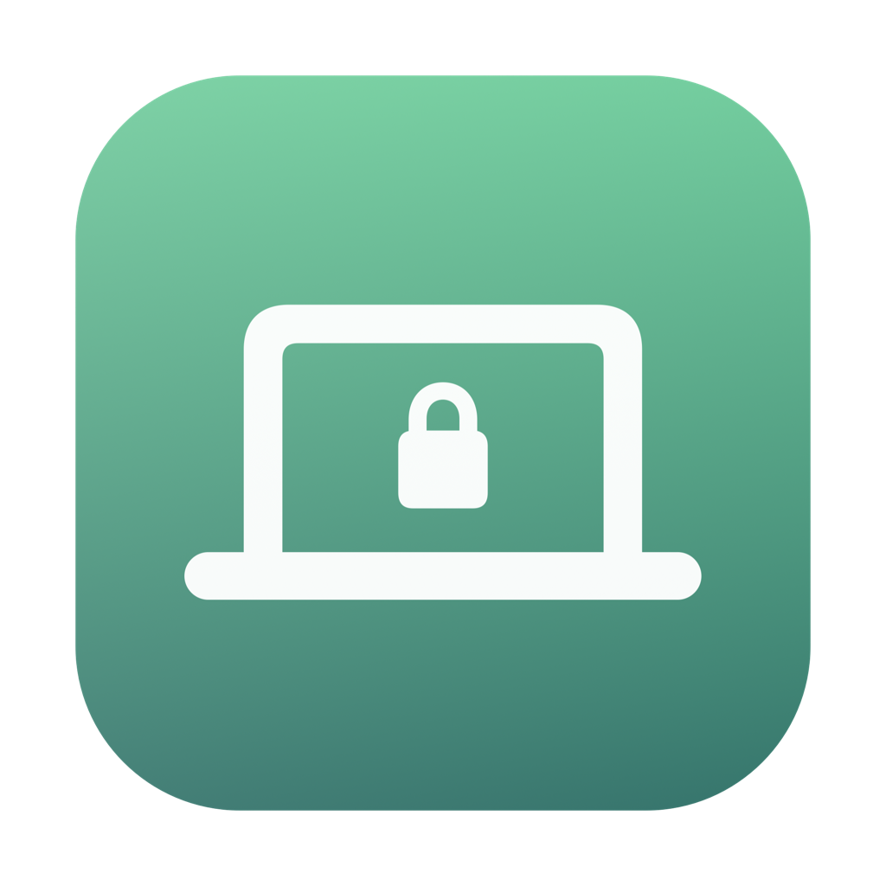
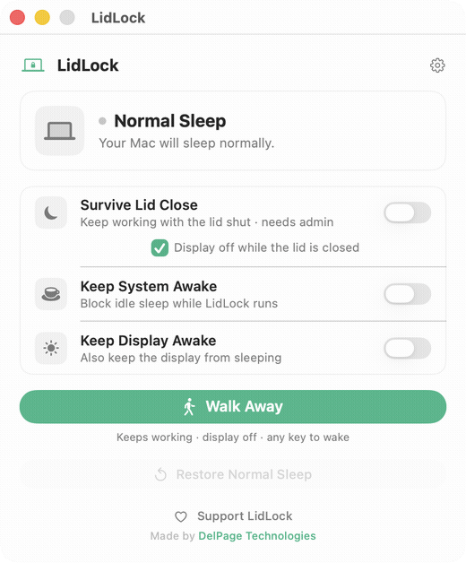
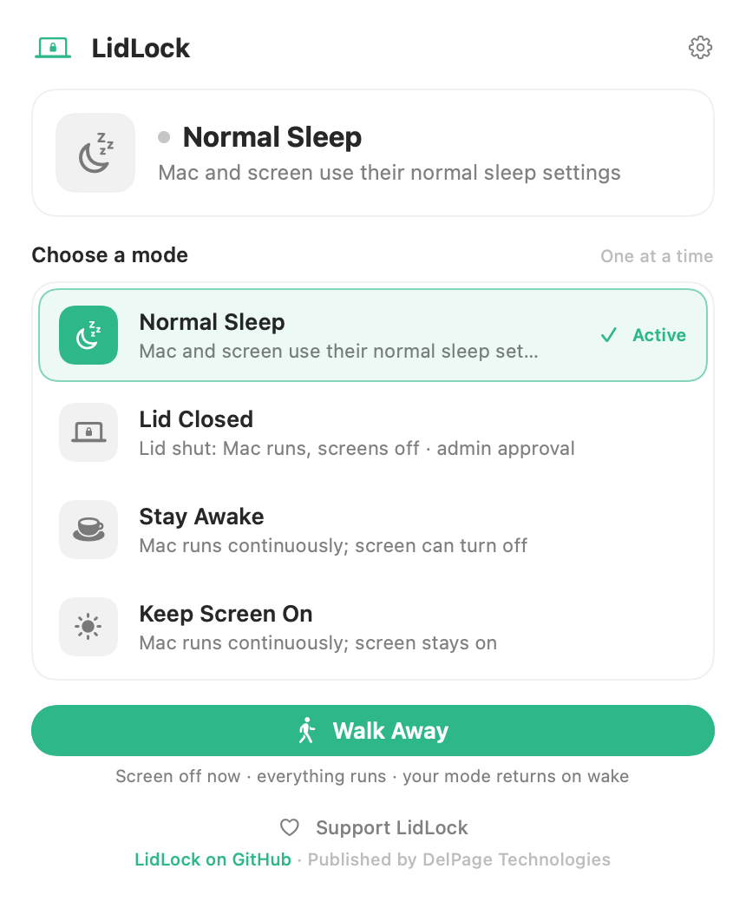
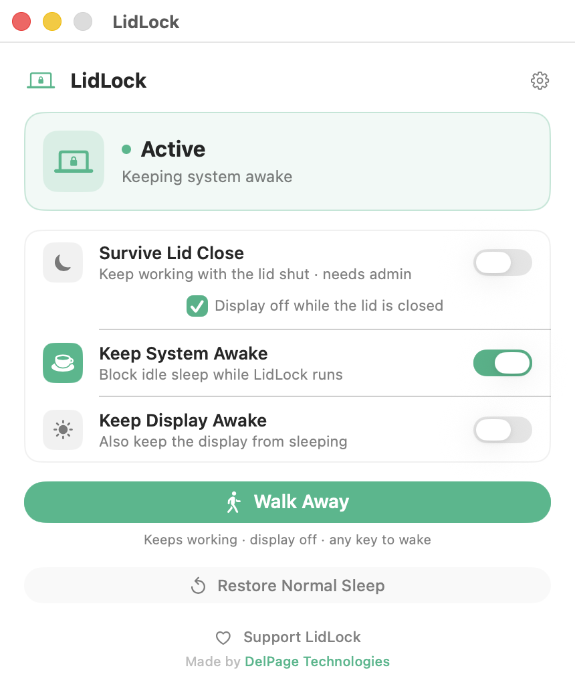

# LidLock

Keep your MacBook running with the lid closed.

LidLock is a signed and notarized macOS app for local servers, downloads,
automations, and long builds. It gives you clear controls for the Mac power
settings people usually manage with Terminal commands.

LidLock is free software published by DelPage Technologies.

  

  

## Free Download

- [Download LidLock.dmg](https://github.com/DelPage/lidlock/releases/latest/download/LidLock.dmg)
- Current version: **1.1.3**
- SHA-256: `fe735f2a9cebdbd5807163d4099c75df6141d70ca36aa91265562caf1d78e8af`

LidLock requires **macOS 13 Ventura or newer**. The distributed app is signed with Apple Developer ID and notarized by Apple.

## What It Does

- **Survive Lid Close** keeps your MacBook running when the lid is closed.
- **Password-free lid control** can install a signed helper from Settings so approved users do not have to enter their password every time.
- **Keep System Awake** blocks idle system sleep while LidLock runs.
- **Keep Display Awake** prevents the display from sleeping.
- **Walk Away** keeps work running while turning the display off.
- **Restore Normal Sleep** releases LidLock's protections and returns macOS to normal behavior.
- Closing the window keeps LidLock available in the menu bar; reopen it from
  **Open LidLock** or quit it explicitly from the same menu.

LidLock always shows the real current system state, so you can see what is keeping the Mac awake and turn it off quickly.

## Screenshots

| Normal sleep | Active keep-awake |
|---|---|
|  |  |

## Privacy

LidLock is private by default:

- No accounts.
- No analytics.
- No telemetry.
- No automatic network access during normal operation.

Read the [LidLock privacy policy](PRIVACY.md).

## Support and Bug Reports

Use [GitHub Issues](https://github.com/DelPage/lidlock/issues) for bug reports and compatibility notes. Please include your macOS version, Mac model, LidLock version, and what you expected to happen.

If you would like to support continued maintenance, you can make an optional
[donation through Stripe](https://donate.stripe.com/aFa00b4b27J2cR18e4asg03).
LidLock works the same whether or not you donate.

## Closed Source Notice

This public repository is for distribution, screenshots, releases, and issue tracking. The LidLock application source code is not published here.

LidLock is proprietary software from DelPage Technologies. See [EULA.md](EULA.md)
for the license terms that apply to the compiled app and [CONTRIBUTING.md](CONTRIBUTING.md)
for the public-repository boundary.

## Links

- Releases: [GitHub Releases](https://github.com/DelPage/lidlock/releases)
- Privacy policy: [PRIVACY.md](PRIVACY.md)
- Support: [SUPPORT.md](SUPPORT.md)
- Changelog: [CHANGELOG.md](CHANGELOG.md)
