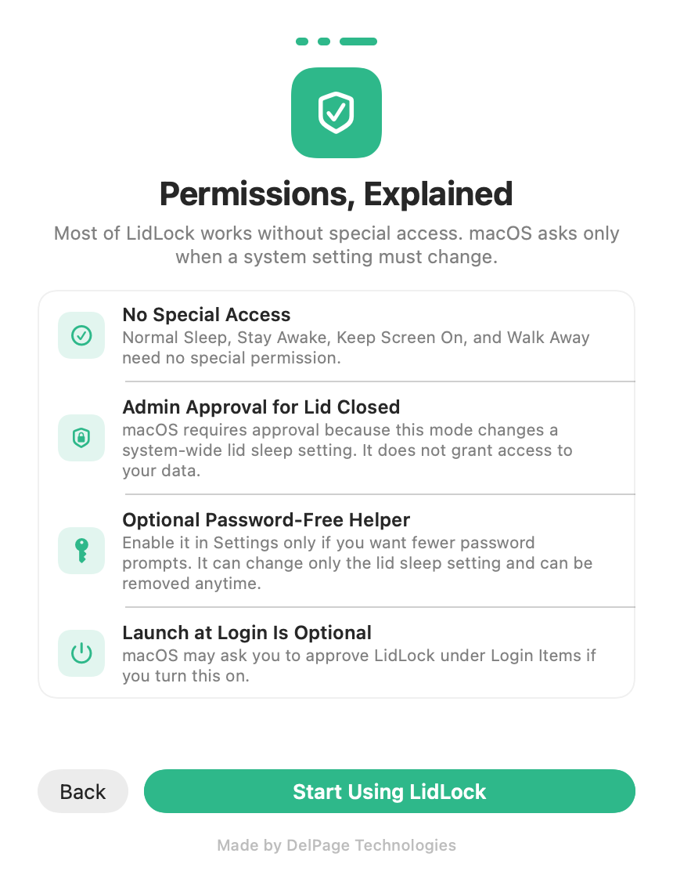

# LidLock

Keep your MacBook running with the lid closed.

LidLock is a signed and notarized macOS app for local servers, downloads,
automations, and long builds. It gives you clear controls for the Mac power
settings people usually manage with Terminal commands.

LidLock is free software published by DelPage Technologies.

  

  

  <em>Preview of the next signed LidLock update, currently being tested.</em>

## Free Download

- [Download LidLock.dmg](https://github.com/DelPage/lidlock/releases/latest/download/LidLock.dmg)
- Current version: **1.1.3**
- SHA-256: `fe735f2a9cebdbd5807163d4099c75df6141d70ca36aa91265562caf1d78e8af`

LidLock requires **macOS 13 Ventura or newer**. The distributed app is signed with Apple Developer ID and notarized by Apple.

## Getting Started

The next signed update guides every new user through the four modes, Walk Away,
menu bar behavior, safety, and permissions before they begin. The guide can be
reopened anytime from **Settings**, then **Getting Started**.

[Read the complete installation and permissions guide](GETTING_STARTED.md).

## What It Does

- **Normal Sleep** returns the Mac and display to their usual sleep settings.
- **Lid Closed** keeps your MacBook running with the lid shut while screens turn off.
- **Stay Awake** keeps work running while allowing the display to turn off.
- **Keep Screen On** keeps both the Mac and its display awake.
- **Walk Away** turns the display off immediately, keeps work running, and restores the selected mode when the display wakes.
- **Password-free lid control** can install a signed helper from Settings so approved users do not have to enter their password every time.
- Closing the window keeps LidLock available in the menu bar; reopen it from
  **Open LidLock** or quit it explicitly from the same menu.

LidLock always shows the real current system state, so you can see what is keeping the Mac awake and turn it off quickly.

## Permissions at a Glance

| Feature | Approval | Why |
|---|---|---|
| Normal Sleep, Stay Awake, Keep Screen On, and Walk Away | None | These features do not need special access. |
| Lid Closed | Administrator approval | macOS protects the system wide lid sleep setting that this mode changes. |
| Password Free Lid Control | Optional helper approval | The signed helper avoids repeated password prompts and can change only the lid sleep setting. |
| Launch at Login | Optional Login Items approval | macOS lets you choose which apps may open when you sign in. |

LidLock does not request access to files, screen contents, camera, microphone,
location, contacts, or Accessibility controls. Read
[Getting Started](GETTING_STARTED.md#permissions-and-approvals) for the full
explanation.

## Next Update Preview

These screenshots show the redesigned mode interface now in testing. The
download above remains version 1.1.3 until the next signed release is published.

| Four clear modes | First-run guide |
|---|---|
|  |  |

## Privacy

LidLock is private by default:

- No accounts.
- No analytics.
- No telemetry.
- No automatic network access during normal operation.

Read the [LidLock privacy policy](PRIVACY.md).

## Support and Bug Reports

Use [GitHub Issues](https://github.com/DelPage/lidlock/issues) for bug reports and compatibility notes. Please include your macOS version, Mac model, LidLock version, and what you expected to happen.

If you would like to support continued maintenance, you can
[choose a donation amount](SUPPORT.md#support-lidlock). LidLock works the same
whether or not you donate.

## Closed Source Notice

This public repository is for distribution, screenshots, releases, and issue tracking. The LidLock application source code is not published here.

LidLock is proprietary software from DelPage Technologies. See [EULA.md](EULA.md)
for the license terms that apply to the compiled app and [CONTRIBUTING.md](CONTRIBUTING.md)
for the public-repository boundary.

## Links

- Releases: [GitHub Releases](https://github.com/DelPage/lidlock/releases)
- Getting started: [GETTING_STARTED.md](GETTING_STARTED.md)
- Privacy policy: [PRIVACY.md](PRIVACY.md)
- Support: [SUPPORT.md](SUPPORT.md)
- Changelog: [CHANGELOG.md](CHANGELOG.md)
