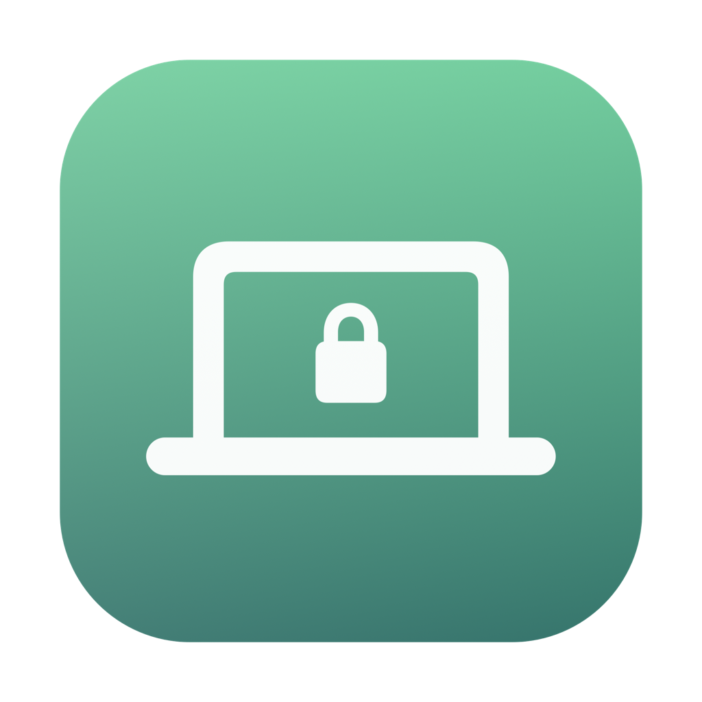
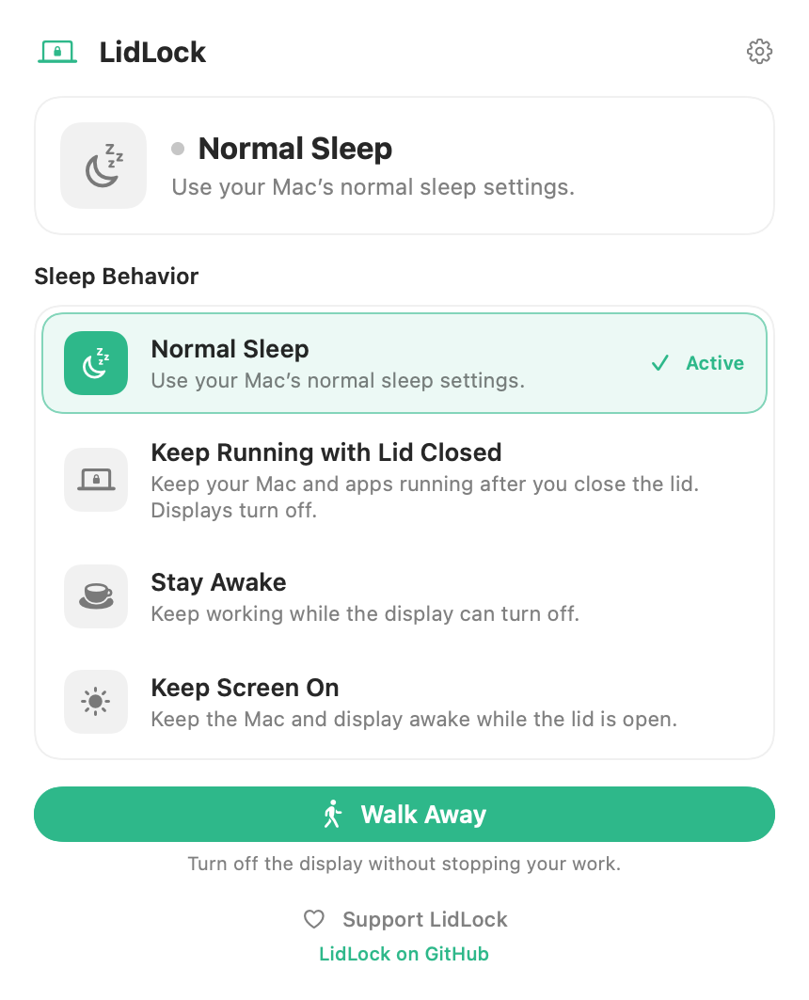
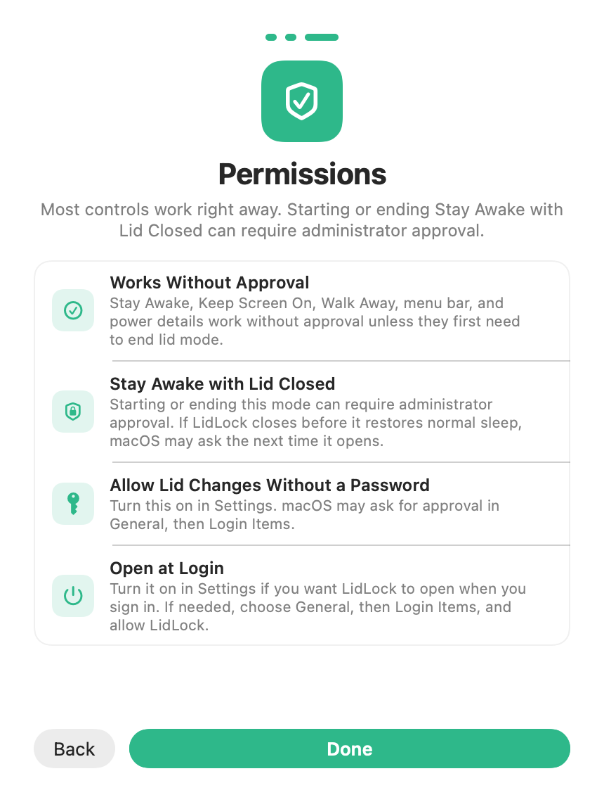

# LidLock

Keep your Mac working, even with the lid closed.

LidLock helps keep your Mac awake for local servers, downloads, automations, and long builds.
What continues can depend on the app and macOS behavior. No Terminal commands required.

LidLock is free software published by DelPage Technologies.

  

  

## Free Download

- [Download LidLock.dmg](https://github.com/DelPage/lidlock/releases/latest/download/LidLock.dmg)
- Current version: **1.2.2**
- SHA-256: `7972ce8f12760ec576b0d72eff97d0731057e9de36c317dca45cde12a86a3d1a`

LidLock requires **macOS 13 Ventura or newer**. Apple signs the distributed app
with Developer ID and notarizes it.

## Getting Started

Version 1.2.2 explains which actions work immediately and which ones need
administrator approval or approval in Login Items. LidLock also shows a prompt
before a protected action and tells you exactly what to approve. You can reopen
the first launch guide anytime from **Settings**, then **Getting Started**.

[Read the complete guide to install LidLock and review its permissions](GETTING_STARTED.md).

## What It Does

- **Normal Sleep** uses your Mac's normal sleep settings.
- **Stay Awake with Lid Closed** keeps the Mac awake after you close the lid. Your Lock Screen settings still apply.
- **Stay Awake** keeps your work running while the display can turn off.
- **Keep Screen On** keeps the Mac and display awake while the lid is open.
- **Walk Away** turns the display off without stopping your work.
- Closing the window keeps LidLock available in the menu bar; reopen it from
  **Open LidLock** or quit it explicitly from the same menu.
- In version 1.2.1, the lid-closed mode no longer issues a display sleep command
  when the lid closes. This removes LidLock's direct Lock Screen trigger. LidLock
  reads the lid-close setting back before showing **Active**, then holds a
  stronger system sleep assertion while active. macOS Lock Screen settings still
  apply.
- In version 1.2.2, LidLock explains any extra approval before it continues.
  Prompts cover administrator approval, Login Items approval, restoring normal
  sleep, and quitting while the lid setting is still on.

## Permissions at a Glance

| Feature | Approval | Why |
|---|---|---|
| Normal Sleep, Stay Awake, Keep Screen On, and Walk Away | None | They work as soon as LidLock opens. |
| Stay Awake with Lid Closed | Administrator approval when saved approval is off | macOS protects changes to how the Mac sleeps with its lid shut. |
| Allow lid changes without a password | Optional Login Items approval | A signed helper can change only the lid sleep setting. |
| Open at login | Optional Login Items approval | macOS lets you choose which apps open when you sign in. |

When an extra step is needed, LidLock shows a prompt before it continues. If
approval must be completed in System Settings, LidLock can open Login Items for
you and shows that approval is still pending.

LidLock does not request access to files, screen contents, camera, microphone,
location, contacts, or Accessibility controls. Read
[Getting Started](GETTING_STARTED.md#permissions-and-approvals) for the full
explanation.

## Interface

| Sleep controls | First launch guide |
|---|---|
|  |  |

## Privacy

LidLock is private by default:

- No accounts.
- No analytics.
- No telemetry.
- No automatic network access while you use LidLock.

Read the [LidLock privacy policy](PRIVACY.md).

## Support LidLock

LidLock is free and works the same for everyone. The
[Support LidLock page](SUPPORT.md) has $5, $10, $25, $100, and custom donation
options.

## Bug Reports

Use [GitHub Issues](https://github.com/DelPage/lidlock/issues) for bug reports and compatibility notes. Please include your macOS version, Mac model, LidLock version, and what you expected to happen.

## Closed Source Notice

This public repository contains releases, screenshots, and issue tracking. The
private source repository remains separate.

DelPage Technologies publishes LidLock as proprietary software. Read the
[EULA](EULA.md) for license terms and [CONTRIBUTING](CONTRIBUTING.md) for the
public repository boundary.

## Links

- Releases: [GitHub Releases](https://github.com/DelPage/lidlock/releases)
- Getting started: [GETTING_STARTED.md](GETTING_STARTED.md)
- Privacy policy: [PRIVACY.md](PRIVACY.md)
- Support: [SUPPORT.md](SUPPORT.md)
- Changelog: [CHANGELOG.md](CHANGELOG.md)
